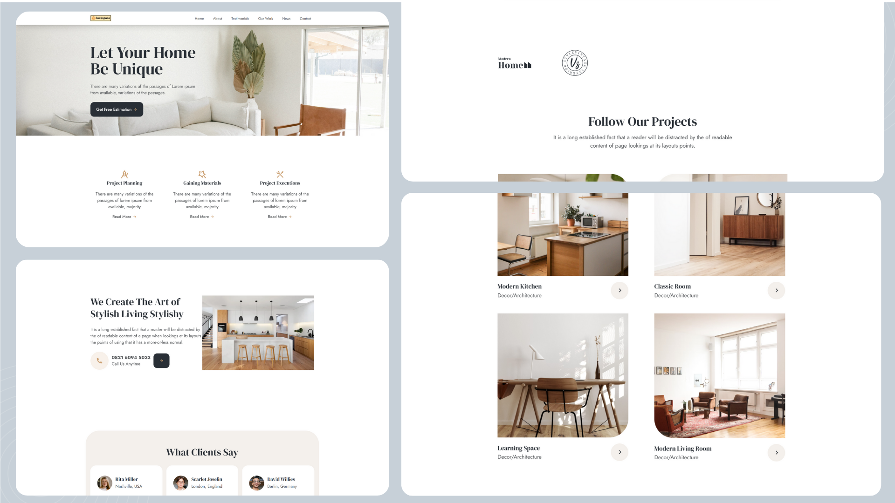

# 🏢 LuxeSpace – Company Landing Page (Frontend Static)

**LuxeSpace** is a simple and elegant company landing page designed for an interior design business. Built using **HTML**, **TailwindCSS**, and **Swiper.js**, this project focuses on delivering a clean, responsive, and modern layout to professionally present business information.

---

## 1. Project Overview

A static single-page site showcasing company details such as services, testimonials, portfolio, articles, and contact information. Ideal as a starting template for company profiles or static business landing pages.

---

## 2. Goals

- Create a modern, professional landing page layout.
- Learn and apply responsive design using TailwindCSS.
- Integrate a testimonial slider with Swiper.js.
- Practice building user-friendly navigation and clean HTML structure.

---

## 3. Challenges

- Structuring a responsive layout for multiple screen sizes.
- Implementing sticky navigation and smooth scroll.
- Building a testimonial carousel using Swiper.js.
- Maintaining visual consistency while using semantic HTML tags.

---

## 4. Tech Stack

- **HTML + TailwindCSS** – Responsive layout and utility-first styling.
- **Remix Icons** – For clean and modern UI icons.
- **Swiper.js** – For interactive testimonial slider.
- **ScrollReveal** – For scroll-based animation effects.

---

## 5. Folder Structure

```
project/
├── index.html              # Main page structure
├── /assets                 # Images and icons
├── /css                    # Swiper CSS files
├── /js                     # ScrollReveal and Swiper logic
├── /dist/output.css        # Tailwind compiled CSS
```

---

## 6. What I Learned

- How to build responsive layouts with TailwindCSS.
- Basic integration of third-party JS libraries like Swiper.js and ScrollReveal.
- Importance of semantic HTML and accessible design.
- Structuring frontend projects with maintainability in mind.

---

## 🌐 Live Preview

[https://luxespace.netlify.app/](https://luxespace.netlify.app/)

---
